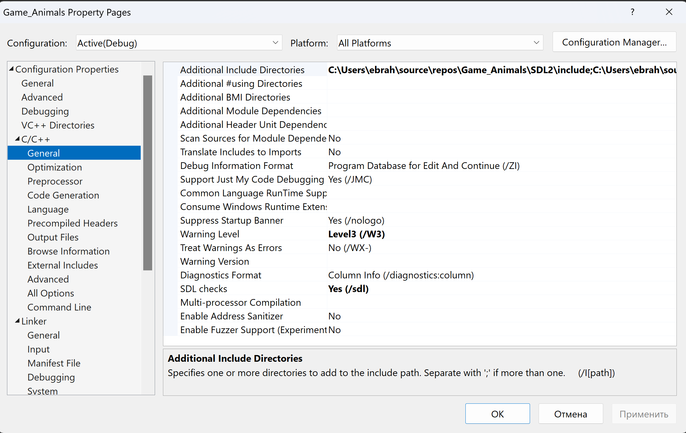
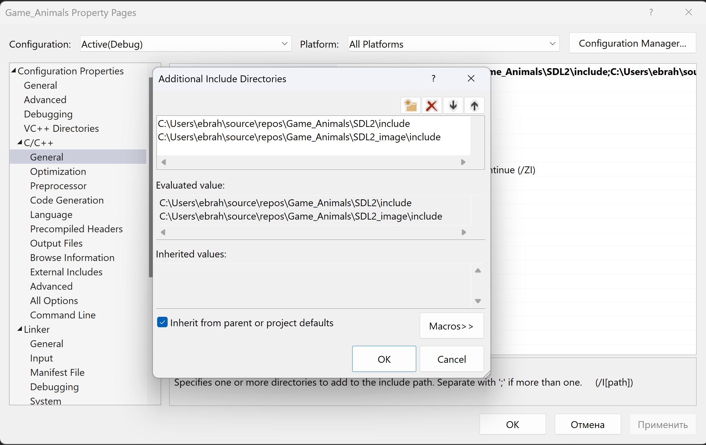
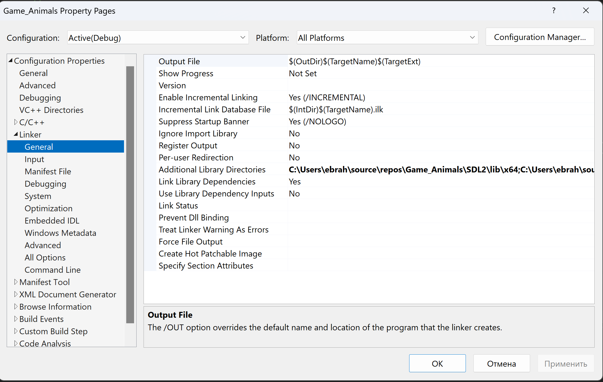
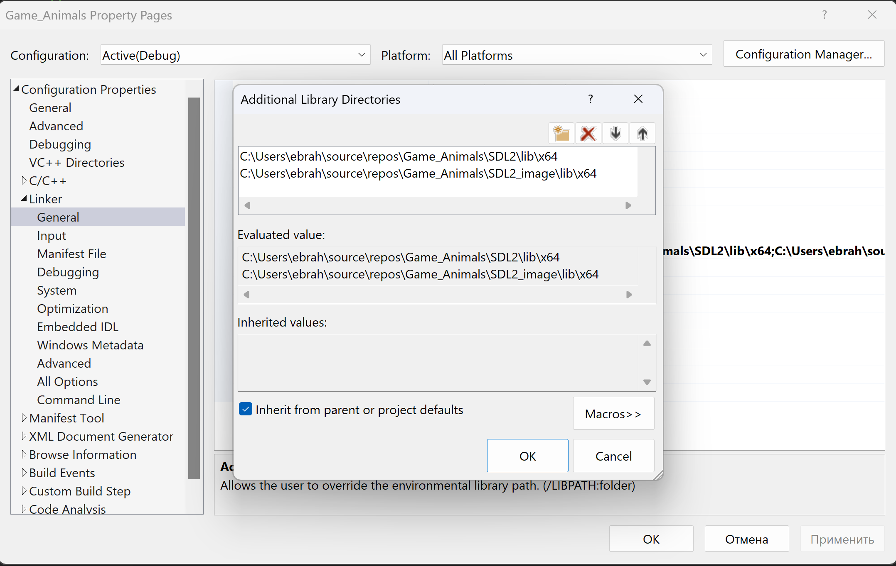
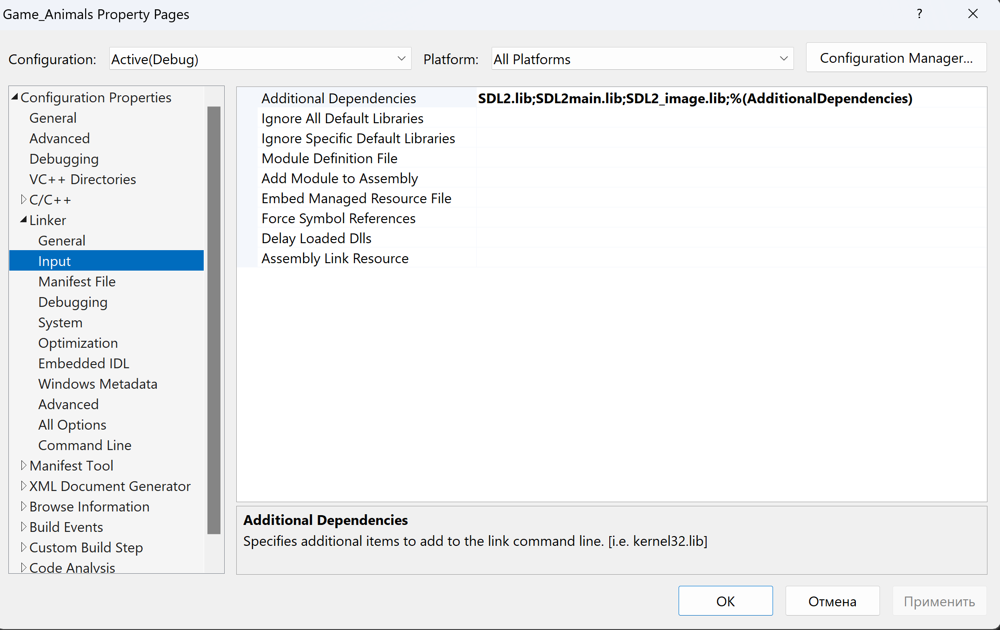
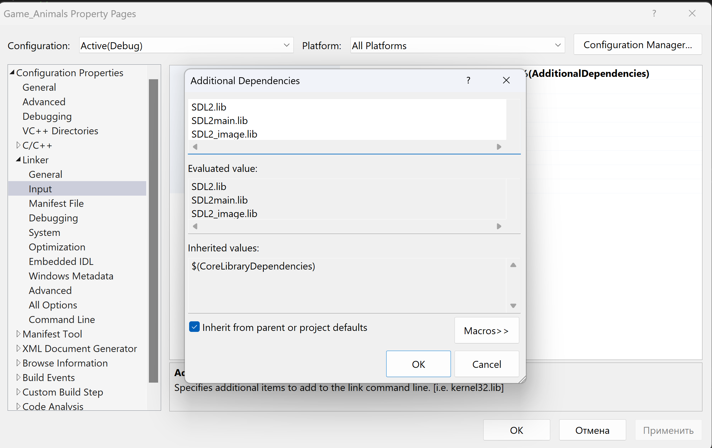

# Game engine

Version 0.0.1

Written in C++ and SDL .

# Setup Development Environment:

* Install SDL2 and SDL2_image: You need to download and install SDL2 and SDL2_image libraries 
  * [SDL2-devel-2.28.5-VC.zip](https://github.com/libsdl-org/SDL/releases/tag/release-2.28.5#:~:text=SDL2%2Ddevel%2D2.28.5%2DVC.zip)
  * [SDL2_image-devel-2.8.1-VC.zip](https://www.libsdl.org/projects/SDL_image/release/SDL2_image-devel-2.8.1-VC.zip)
    
    Make sure to get the development libraries for your operating system.
* Setup C++ Development Environment: You need a C++ compiler and an IDE
    * Visual Studio
     `Note: I have used Visual Studio 2022` 

  ### Configure Your Project to Use SDL and SDL_image:

    * Right-click on your project in the Solution Explorer and choose "Properties".
    * Under Configuration Properties, go to C/C++ Directories.
      
        1. In "Include Directories", add the paths to the include folders of both SDL2 and SDL_image
           e.g., C:\SDL\SDL2-x.x.x\include and C:\SDL\SDL2_image-x.x.x\include.
           
          { width=20%}
      
        2. In "Library Directories", add the paths to the lib folders of both SDL2 and SDL_image
           { width=20%}
          { width=20%}
       e.g., C:\SDL\SDL2-x.x.x\lib\x64 and C:\SDL\SDL2_image-x.x.x\lib\x64 (choose x64 or x86 based on your project's architecture).

    ### Link the Libraries:
    
    1. In the project properties, navigate to Linker -> Input.
     { width=80%}
     { width=80%}
  
    2. In "Additional Dependencies", add SDL2.lib, SDL2main.lib, and SDL2_image.lib.
      1. Copy the DLLs to Your Project:
      2. Copy SDL2.dll and SDL2_image.dll from the lib\x64 (or lib\x86) folders to your project’s directory where the executable is generated (often in the Debug or Release folder).
